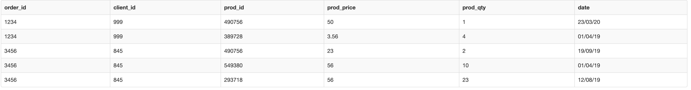
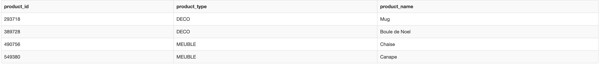
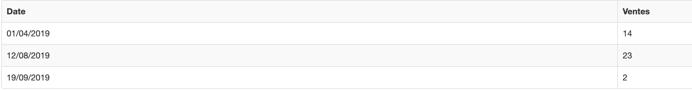

# SQL Question

- [Create Table](#Create)
- [First Question](#First_Question)
- [Second Question](#Second_Question)

## Create
Firstly, we have to generate two tables `transactions` and `product_nomEnclature`.
```mysql
CREATE TABLE IF NOT EXISTS transactions (
  `order_id` int(16) NOT NULL,
  `client_id` int(16) NOT NULL,
  `prod_id` int(16) NOT NULL,
  `prod_price` double NOT NULL,
  `prod_qty` int(16) NOT NULL,
  `date` varchar(20) NOT NULL
);

CREATE TABLE IF NOT EXISTS product_nomEnclature (
  `product_id` int(16) NOT NULL,
  `product_type` varchar(200) NOT NULL,
  `product_name` varchar(200) NOT NULL,
   PRIMARY KEY (`product_id`)
);

INSERT INTO `transactions` (`order_id`, `client_id`, `prod_id`,`prod_price`,`prod_qty`,`date`) VALUES
  (1234, 999, 490756, 50, 1, '23/03/20'),
  (1234, 999, 389728, 3.56, 4, '01/04/19'),
  (3456, 845, 490756, 23, 2, '19/09/19'),
  (3456, 845, 549380, 56, 10, '01/04/19'),
  (3456, 845, 293718, 56, 23, '12/08/19');

INSERT INTO `product_nomEnclature` (`product_id`, `product_type`, `product_name`) VALUES
  (490756, 'MEUBLE', 'Chaise'),
  (389728, 'DECO', 'Boule de Noel'),
  (549380, 'MEUBLE', 'Canape'),
  (293718, 'DECO', 'Mug');

```
As result :

Transactions Table:


Products Table:



## First_Question
```mysql
SELECT date_format(str_to_date(date, '%d/%m/%Y'), '%d/%m/%Y') AS Date, SUM(prod_qty) AS Ventes
FROM transactions
WHERE STR_TO_DATE(date, '%d/%m/%Y') BETWEEN '2019-01-01' AND '2019-12-31'
GROUP BY date
ORDER BY date
````
**Note**: As original `date` which is formed in `01/01/20` rather than a standard Data type in MySQL, so we need to convert `01/01/20` to `2020-01-01` while comparing it's interval. 
Next, we need to convert `01/01/20` to `01/01/2020` as being mentioned in question description.

You should get:

## Second_Question

### First Solution
```mysql
SELECT t1.client_id, t1.ventes_meuble, t2.ventes_deco FROM
  (SELECT ts.client_id, sum(ts. prod_qty) AS ventes_meuble
  FROM transactions as ts, product_nomEnclature AS pn
  WHERE ts.prod_id = pn.product_id
  AND pn.product_type = 'MEUBLE'
  GROUP BY ts.client_id) AS t1
  
  inner join
  
  (SELECT ts.client_id, sum(ts. prod_qty) as ventes_deco
  FROM transactions as ts, product_nomEnclature as pn
  WHERE ts.prod_id = pn.product_id
  AND pn.product_type = 'DECO'
  GROUP BY ts.client_id) AS t2
  
  ON t1.client_id = t2.client_id
```
**Note**: Intuitively, we can generate two tables as the sum of `MEUBLE` and `DECO` respectively for each client. And merge these two in one single table. But if either `ventes_meuble` or `ventes_deco` is `0`, its client_id will not be took in count as result.

I got this:

### Second Solution

```mysql
SELECT ts.client_id, 
SUM( CASE WHEN pn.product_type = 'MEUBLE' THEN ts.prod_qty ELSE 0 END) AS ventes_meuble, 
SUM( CASE WHEN pn.product_type = 'DECO' THEN ts.prod_qty ELSE 0 END) AS ventes_deco
  FROM transactions AS ts, product_nomEnclature AS pn
  WHERE ts.prod_id = pn.product_id
  GROUP BY ts.client_id
```

**Note**: Similarly, we can directly calculate the number of `MEUBLE` and `DECO` for each client by using `CASE` keyword. And it will give us a complete result even either `ventes_meuble` or `ventes_deco` is `0`.

I got this:


## Maintainer

[@Linzhou ZHONG](https://github.com/linzhou-zhong)
