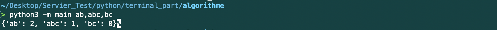
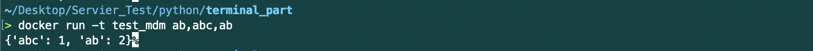
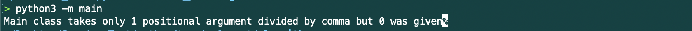
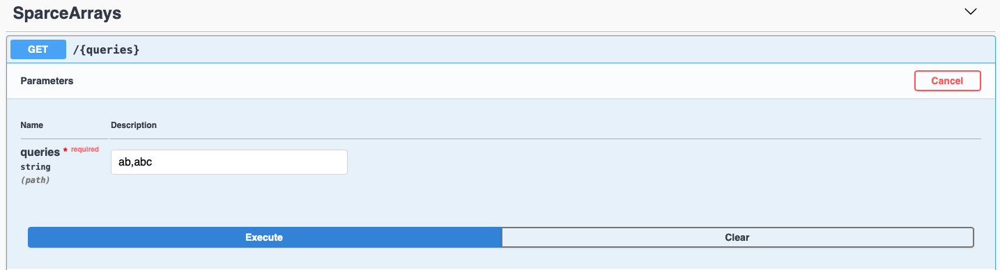
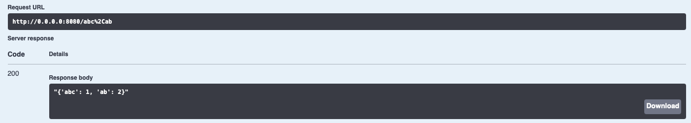

# SparseArrays

- [Introduction](#Introduction)
- [Context](#Context)
- [Example](#Example)
- [Usage](#Usage)
- [Method](#Method)
- [Dockerfile](#Dockerfile)

## Introduction
This project is based on [Hackerrank's SparseArrays](https://www.hackerrank.com/challenges/sparse-arrays/problem).

For testing question 1 - question 3, please using code from  `terminal_part`.

For testing question 4, please using code from `flask_part`.

As terminal part, we have to check if user didn't forget adding queries in `commandline`, throw Exception if necessary. 

And thanks for flask, we don't need to verify for queries anymore from `commandline`. That's the reason why there're two folders for python test.

## Context
There is a collection of input strings and a collection of query strings. For each query string, determine how many times it occurs in the list of input strings. Return an array of the results.

### Example

```python
# Standard Input
strings = ['ab', 'ab', 'abc']
queries = ['ab', 'abc', 'bc']
```

There are `2` instances of `ab`, `1` of `abc` and `0` of `bc`. For each query, add an element to the return array, `results = [2, 1, 0]`


## Usage

### Python 2.x
See [**terminal_part**](https://github.com/linzhou-zhong/servier_test/tree/master/python/terminal_part) for more details
```commandline
python -m main abc,ab,ac
```

### Python 3.x
See [**terminal_part**](https://github.com/linzhou-zhong/servier_test/tree/master/python/terminal_part) for more details
```commandline
python3 -m main abc,ab,ac
```
**Note**: We are allowed to enter at most 20 parameters and each one is separated by `,` without any `space`.

You should get:



### Docker
See [**terminal_part**](https://github.com/linzhou-zhong/servier_test/tree/master/python/terminal_part) for more details.
```commandline
docker build . -t test_mdm
docker run -t test_mdm ab,abc,bc
```

You should get:



If missed queries as input:




### Docker with Expose Port (Flask & Swagger)
See [**flask_part**](https://github.com/linzhou-zhong/servier_test/tree/master/python/flask_part) for more details
```commandline
docker build . -t test_mdm
docker run -p 8080:5000 test_mdm
```

**Note**: We are also allowed to access Swagger UI, go to http://0.0.0.0:8080/apidocs in Chrome or Safari.

You should get:



As result:



## Method
Time Complexity of methods
| Name of method | Time Complexity |
| :------------: | :-------------: |
| count_frequency_brute_force | O (n^2) |
| count_frequency_inner_fuc | O (n^2) |
| count_frequency_optimization | O (n) |

## Dockerfile

```dockerfile
FROM python:3.7
MAINTAINER Linzhou "linzhou.zhong@efrei.net"
ENV STRINGS_INPUT="ab,abc,ab"
COPY . /code
WORKDIR /code
EXPOSE 5000
RUN pip3 install -r config/requirements.txt
WORKDIR /code/algorithme
ENTRYPOINT ["python3","-m","main"]
```
**Note**: As asked I was allowed to use `python:3.7` as image. Set our Environment Variable by using `ENV`, 
and `COPY` our host local files into container's local folder `code`. `WORKDIR` tells container that we will work in `code` folder.
In order to access our container, we expose interface 5000 by `EXPOSE`, officially it doesn't make sens just only inform us that port 5000 may be exposed. Install all necessary packages that we need which are totally mentioned in `requirements.txt`.
Once container is running, we start our application from command `ENTRYPOINT ["python3","-m","main"]`.


## Maintainer

[@Linzhou ZHONG](https://github.com/linzhou-zhong)
